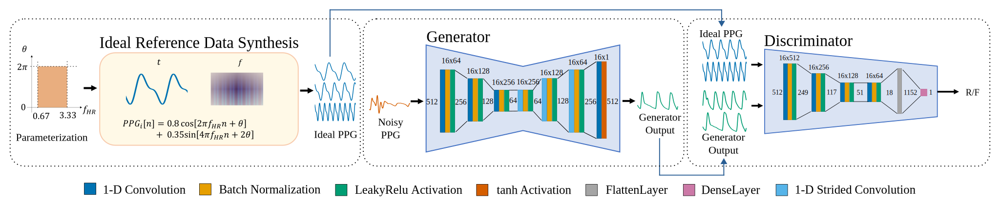

## Efficient and Robust Heart Rate Estimation Approach for Noisy Wearable PPG Sensors Using Ideal Representation Learning

Welcome to the official implementation of our paper "Efficient and Robust Heart Rate Estimation Approach for Noisy Wearable PPG Sensors Using Ideal Representation Learning". Please cite our work as,
> ``` Amashi Niwarthana, Pamuditha Somarathne, Pierre Qian, Ken-Tye Yong, and Anusha Withana. 2024. Efficient and Robust Heart Rate Estimation Approach for Noisy Wearable PPG Sensors Using Ideal Representation Learning. In Proceedings of the 2024 ACM International Symposium on Wearable Computers (ISWC ’24), October 5–9, 2024, Melbourne, VIC, Australia. ACM, New York, NY, USA, 8 pages. https://doi.org/10.1145/3675095.3676606 ```

### Abstract
Photoplethysmography (PPG) is a non-invasive wearable sensing method used in millions of devices for heart rate monitoring. However, PPG signals are highly susceptible to a variety of noise sources, including motion artifacts, sensor noise, and biological factors, especially in real-world wearable settings. These make designing generalizable models to accurately interpret cardiac activities challenging. This paper proposes a focus shift from learning with noisy signals to utilizing the characteristics of a mathematically modelled PPG waveform in an adversarial setting to increase the signal-to-noise ratio. The results show the proposed approach is robust against noisy data. We evaluated the model in a user study (N=22), where it was tested against unseen PPG data collected from a new sensor and users under three different activity levels. Results showed the generalisability of the approach compared to the state-of-the-art and it maintains consistent performance improvements across diverse user activities. We successfully implemented our model on a commonly used (android) mobile device, confirming its ability to provide fast inferences in a resource-constrained setting.

<p align="center">Our Network architecture</p>

## Test procedure

### 1. Required Packages
```
tensorflow==2.6.0
numpy==1.19.5
pandas
scipy
pickle
h5py
sklearn
neurokit2
biosppy
```

To install the packages,
```pip3 install -r requirements.txt```

### 2. Datasets
To download the datasets, please follow the links below.
- [PTT - User Study dataset](https://physionet.org/content/pulse-transit-time-ppg/1.1.0/)
- [BIDMC](https://physionet.org/content/bidmc/1.0.0/)
- [CAPNO](http://www.capnobase.org/)
- [DALIA](https://archive.ics.uci.edu/ml/datasets/PPG-DaLiA)
- [WESAD](https://archive.ics.uci.edu/ml/datasets/WESAD+%28Wearable+Stress+and+Affec+Detection%29)

### 3. Folder Structure

Before inferring the model, plase make sure that the folder struture is maintained as specified.
```
project
└───data                                                - datasets should be downloaded into this folder
│   └───physionet.org                                   
|   |   └───bidmc-ppg-and-respiration-dataset-1.0.0     - BIDMC dataset
|   |   |   └───...
|   |   |
|   |   └───files/pulse-transit-time-ppg/1.1.0          - PTT dataset
|   |       └───...
|   |
│   └───WESAD                                           - WESAD dataset
|   |   └───S2
|   |   └───S3
|   |   └───...
|   |
│   └───PPG-DaLiA                                       - DALIA dataset
|   |   |   PPG_FieldStudy_readme.pdf
|   |   └───PPG_FieldStudy
|   |   |   └───...
|   |
│   └───dataverse_files capno                           - CAPNO dataset
|       └───data
|       └───S3
|       └───...
│   
└───training_checkpoints                                - this folder contains the checkpoints needed for inference.
|   └───gen
|       |
|       |
|       |
│   readme.md
|   models.py                                           - this file contains the functions for the generator, discriminator and heart rate evaluation.
|   filters.py                                          - this file contains the filters required for preprocessing.
|   utils.py                                            - this file contains functions that are responsible 
                                                          for all data handling. The 4:1 train test splits 
                                                          used for SynthPPG can be loaded to pandas dataframes 
                                                          using this file.
|   test_synthppg.py                                    - this file could be used for inference.
                                                          Currently defined to evaluate the 
                                                          model on PTT dataset. To infer SynthPPG 
                                                          on a different test split, pass the dataset name
                                                          for argument "-d". Dataset names: [train, BIDMC_test, WESAD_test, CAPNO_test, DALIA_test, PTT_test]
```
### 4. Usage
To use the pre-trained model and test on a split from the dataset:

```
python test_synthppg.py [-h] [--dataset D] [--window_size W]

options:
  -h, --help  show this help message and exit
  --dataset D        Dataset: [BIDMC_test, CAPNO_test, DALIA_test, WESAD_test, PTT_test]
  --window_size W        Window size: [4, 8, 16, 32, 64]
```

Please use GitHub issues to raise any concerns.

## Contributors (From aid-lab)

- [@AmashiNiw](https://github.com/AmashiNiw)
- [@PamudithaSomarathne](https://github.com/PamudithaSomarathne)
- [@wdanusha](https://www.github.com/wdanusha)

## License

This work is licensed under a [Creative Commons Attribution 4.0 International License](https://creativecommons.org/licenses/by/4.0/).

<p align="left">
  
</p>